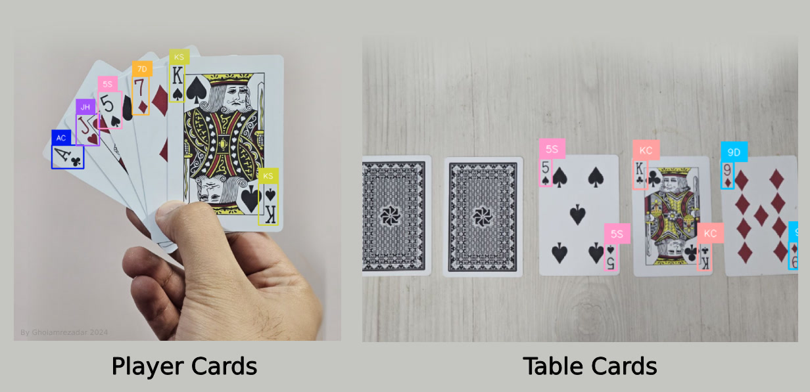
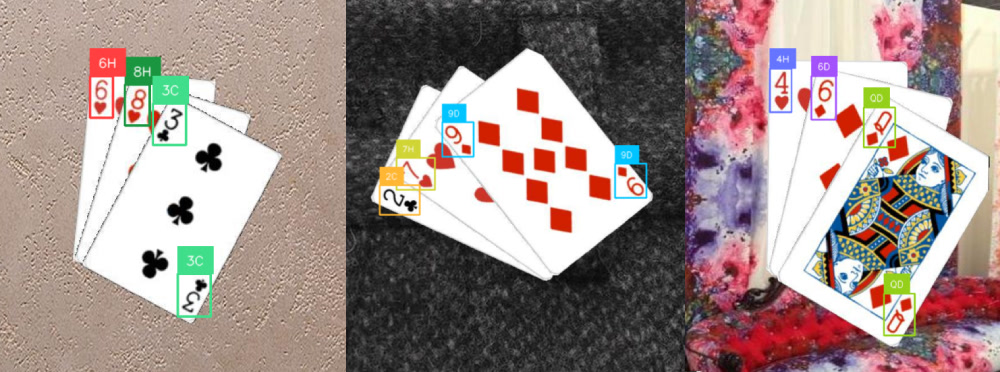
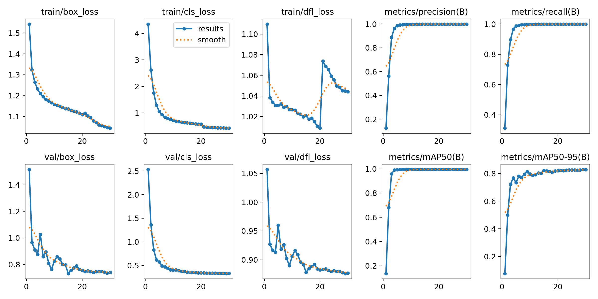
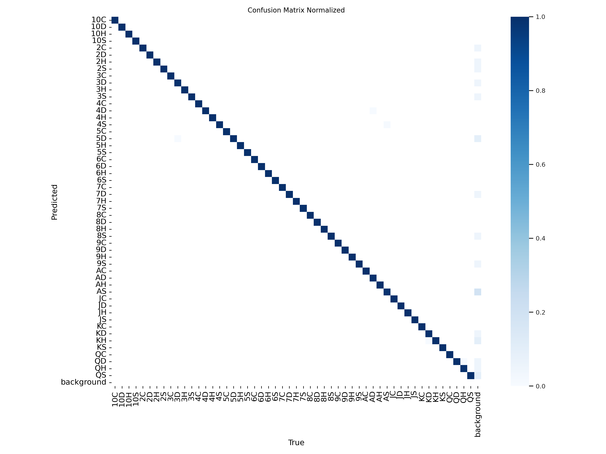
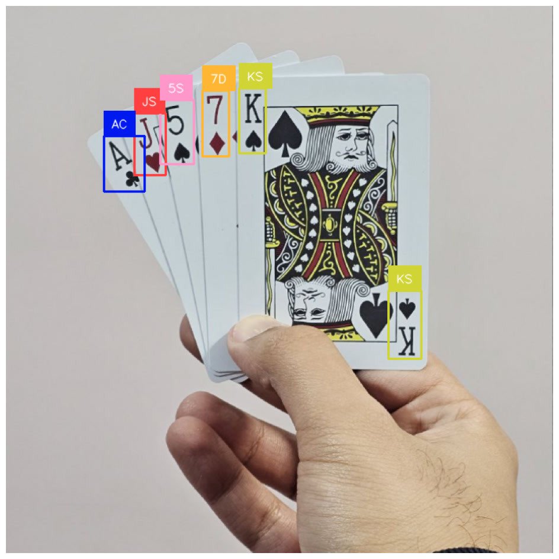
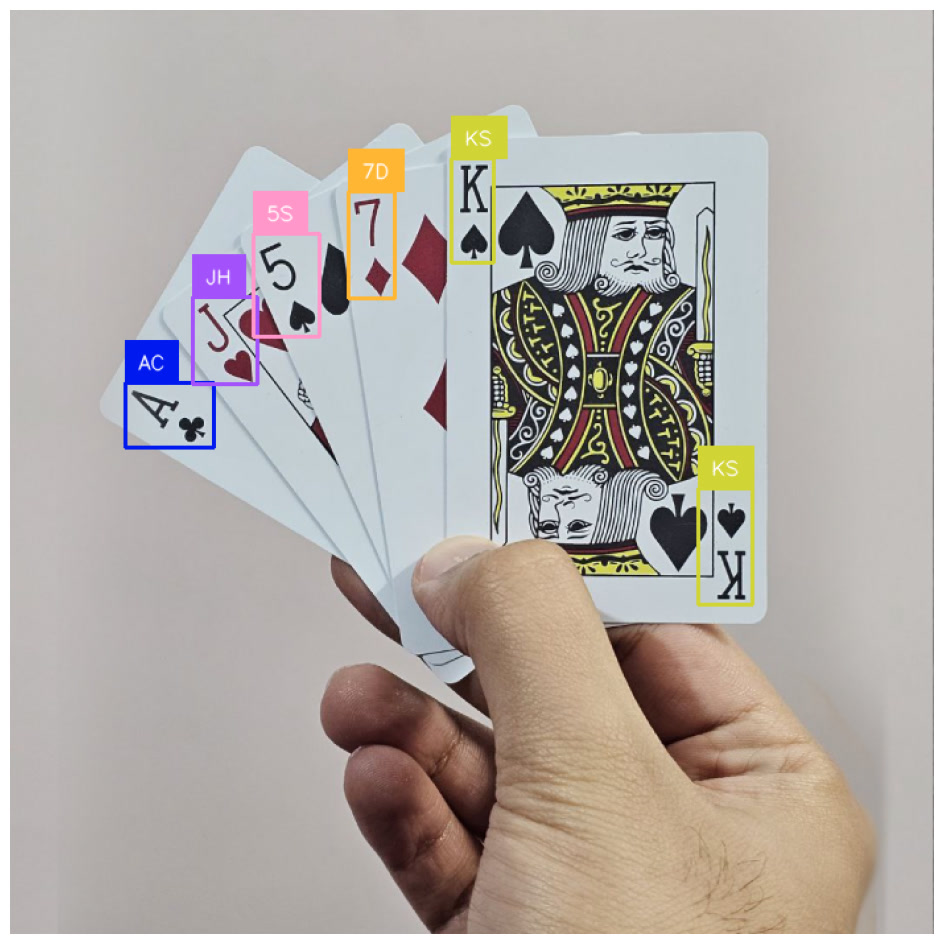
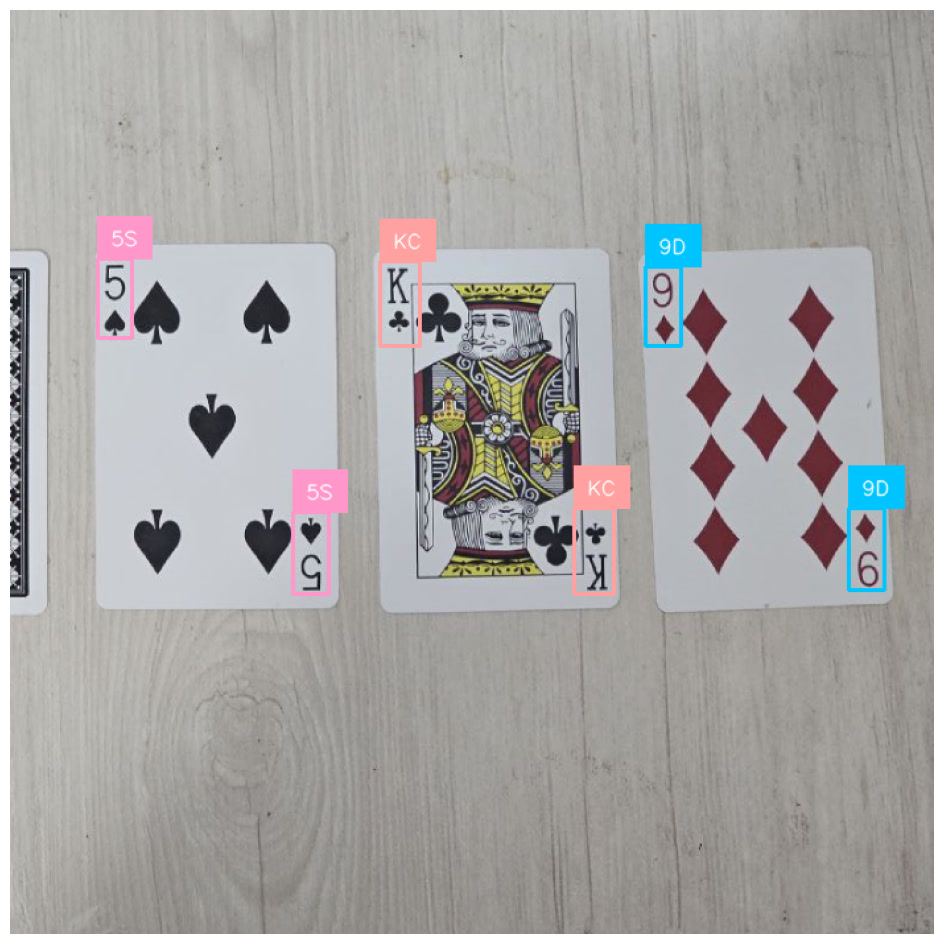

# Poker Hand Detection using YOLO11

Poker Hand Detection using YOLO11.

In this project, I utilized a playing cards [dataset](https://universe.roboflow.com/augmented-startups/playing-cards-ow27d/dataset/4) from Roboflow to train a YOLO11 model for detecting poker hands.
After identifying the cards on the table and in the player's hand, the `analyze_hands.py` script is used to analyze the detected cards and calculate the probabilities of various poker hands occurring.



Watch this [video](https://youtu.be/aeLQXDwPjYo?si=BlhuaHtsBg0fbuWP) on YouTube for a visual demonstration of the project.

## 1. Poker Hand Detection using YOLO11


I used a playing cards dataset from [Roboflow](https://universe.roboflow.com/augmented-startups/playing-cards-ow27d/dataset/4) and trained a YOLO11 model to detect poker hands.
I use this model to detect the cards on the table and on the player's hand.
The code for fine-tuning the model is available in the [Poker_Hand_Detection_YOLO11.ipynb](Poker_Hand_Detection_YOLO11.ipynb) notebook.
The code for doing inference and plotting the results is available in the [Poker_Hand_Inference.ipynb](Poker_Hand_Inference.ipynb) notebook.

*Trained for 30 epochs in 3.78 hours on google colab's T4 GPU.*



### Training Results

- Metrics

    | Class | Images | Instances | Box(P) | R    | mAP50 | mAP50-95 |
    |-------|--------|-----------|--------|------|-------|----------|
    | all   | 2020   | 8080      | 0.999  | 0.999 | 0.995 | 0.83     |

- Losses 

    

- Confusion Matrix

    

### `detect_cards.py` script

The required code for detecting cards in an image and converting the detected cards into a human-readable format is available in the `detect_cards.py` script.

#### Usage

```py
from detect_cards import detect_cards
from detect_cards import decode_cards

# Test on an image
image_path = 'images/test_img_2.png'
weights_path = 'weights/poker_best.pt'
cards = detect_cards(image_path, weights_path)
print(f"\nNumber of cards detected: {len(cards)}")
print(f"Cards sorted from left to right: {cards}")
print("\n".join(decode_cards(cards)))
```

```txt
Number of cards detected: 3
Cards sorted from left to right: ['2C', '7H', '9D']
2 of Clubs
7 of Hearts
9 of Diamonds
```

#### Inference Performance

- Inference on a 3.4GHz CPU without ONNX: `~160ms`
- Inference on a 3.4GHz CPU with ONNX: `~105ms`

### Other Demos

I found out that because the model was trained using square images, it performs best on images with a square aspect ratio where the cards are around the center of the image.

- Cards close to eachother
    
- Cards farther apart
    
- Closeup of the table
    
- Table but squareified
    

## 2. Giving insights to the player about the poker hand

In this part I use the `analyze_hands.py` script to analyze the poker hands detected by the model.

### Analysis Results

After detecting the cards on the table and in the player's hand, I use the `analyze_hands.py` script to analyze the poker hands detected by the model.

#### Usage

```py
from analyze_hands import analyze_hands

analyze_hands(table_cards, player_cards)
```

#### Sample Analysis Results
```py
Table: 3♦ 3♣ 
Hand: 3♠ 3♥ 
-- One Pair: 100%
-- Two Pair: 100%
-- Three of a Kind: 100%
-- Four of a Kind: 100%
-- Full House: 18%

Table: 6♠ 2♥ 3♠ 
Hand: 4♠ 5♥ 
-- Straight: 100%
-- One Pair: 58%
-- Two Pair: 8%
-- Straight Flush: 4%
-- Flush: 4%
-- Three of a Kind: 1%

Table: 6♠ 2♥ 3♠ 
Hand: 4♠ 8♥ 
-- One Pair: 58%
-- Straight: 16%
-- Two Pair: 8%
-- Flush: 4%
-- Three of a Kind: 1%

Table: A♠ 
Hand: 4♠ 6♣ 
-- One Pair: 74%
-- Two Pair: 21%
-- Three of a Kind: 5%
-- Straight: 3%
-- Flush: 3%
-- Full House: 1%
```

## Appendix

### Short Names to Full Names

```py
    card_names = {
        '2C': '2 of Clubs',
        '3C': '3 of Clubs',
        '4C': '4 of Clubs',
        '5C': '5 of Clubs',
        '6C': '6 of Clubs',
        '7C': '7 of Clubs',
        '8C': '8 of Clubs',
        '9C': '9 of Clubs',
        '10C': '10 of Clubs',
        'JC': 'Jack of Clubs',
        'QC': 'Queen of Clubs',
        'KC': 'King of Clubs',
        '2D': '2 of Diamonds',
        '3D': '3 of Diamonds',
        '4D': '4 of Diamonds',
        '5D': '5 of Diamonds',
        '6D': '6 of Diamonds',
        '7D': '7 of Diamonds',
        '8D': '8 of Diamonds',
        '9D': '9 of Diamonds',
        '10D': '10 of Diamonds',
        'JD': 'Jack of Diamonds',
        'QD': 'Queen of Diamonds',
        'KD': 'King of Diamonds',
        '2H': '2 of Hearts',
        '3H': '3 of Hearts',
        '4H': '4 of Hearts',
        '5H': '5 of Hearts',
        '6H': '6 of Hearts',
        '7H': '7 of Hearts',
        '8H': '8 of Hearts',
        '9H': '9 of Hearts',
        '10H': '10 of Hearts',
        'JH': 'Jack of Hearts',
        'QH': 'Queen of Hearts',
        'KH': 'King of Hearts',
        '2S': '2 of Spades',
        '3S': '3 of Spades',
        '4S': '4 of Spades',
        '5S': '5 of Spades',
        '6S': '6 of Spades',
        '7S': '7 of Spades',
        '8S': '8 of Spades',
        '9S': '9 of Spades',
        '10S': '10 of Spades',
        'JS': 'Jack of Spades',
        'QS': 'Queen of Spades',
        'KS': 'King of Spades',
        '2H': '2 of Hearts',
        '3H': '3 of Hearts',
        '4H': '4 of Hearts',
        '5H': '5 of Hearts',
        '6H': '6 of Hearts',
        '7H': '7 of Hearts',
        '8H': '8 of Hearts',
        '9H': '9 of Hearts',
        '10H': '10 of Hearts',
        'JH': 'Jack of Hearts',
        'QH': 'Queen of Hearts',
        'KH': 'King of Hearts',
        '2S': '2 of Spades',
        '3S': '3 of Spades',
        '4S': '4 of Spades',
        '5S': '5 of Spades',
        '6S': '6 of Spades',
        '7S': '7 of Spades',
        '8S': '8 of Spades',
        '9S': '9 of Spades',
        '10S': '10 of Spades',
        'JS': 'Jack of Spades',
        'QS': 'Queen of Spades',
        'KS': 'King of Spades',
    }
```

## Credits

By Gholamreza Dar 2024

### Resources

- https://universe.roboflow.com/augmented-startups/playing-cards-ow27d/dataset/4
- ChatGPT for the poker analysis
